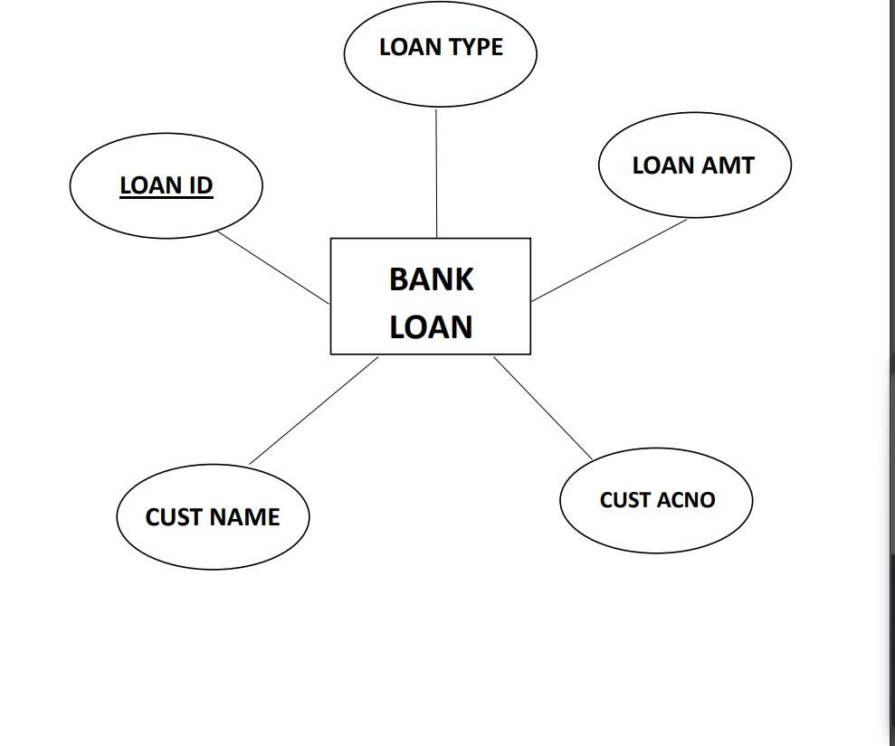

# Ex02 Django ORM Web Application
## Date: 05/12/2024

## AIM
To develop a Django application to store and retrieve data from a bank loan database using Object Relational Mapping(ORM).

## ENTITY RELATIONSHIP DIAGRAM



## DESIGN STEPS

### STEP 1:
Clone the problem from GitHub

### STEP 2:
Create a new app in Django project

### STEP 3:
Enter the code for admin.py and models.py

### STEP 4:
Execute Django admin and create details for 10 books

## PROGRAM
```
models.py

from django.db import models
from django.contrib import admin
# Create your models here.
class Bankloan(models.Model):
    LOAN_ID=models.IntegerField(primary_key=True)
    CUST_NAME=models.CharField(max_length=100)
    LOAN_TYPE=models.CharField(max_length=100)
    CUST_ACNO=models.IntegerField()
    LOAN_AMT=models.IntegerField()
class loan(admin.ModelAdmin):
    list_display=("LOAN_ID","CUST_NAME","LOAN_TYPE","CUST_ACNO","LOAN_AMT")

admin.py

from django.contrib import admin
from .models import Bankloan,loan
# Register your models here.
admin.site.register(Bankloan,loan)
```


## OUTPUT

.png>)

## RESULT
Thus the program for creating a database using ORM hass been executed successfully
